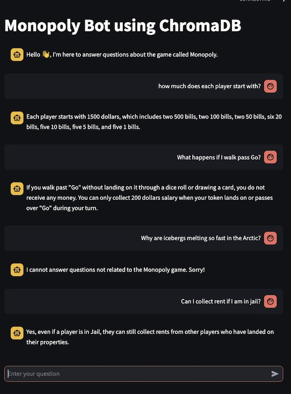

# Monopoly Chatbot using ChromaDB
A chatbot that answers questions about the game Monopoly
using open source LLM from Ollama.  The models are downloaded
to your desktop and the chatbot can be run without an internet connection.
The data is stored in a Vector Data Store using ChromaDB.
https://docs.trychroma.com/docs/overview/introduction

This is built off of my Monopoly Chatot: 
https://github.com/acflippo/Monopoly_Chatbot

The special domain knowledge I'm using is a downloaded play instructions (as this is a RAG implementation for Monopoly) that I've saved as annie_monopoly_vault.txt which I've removed special characters that would make the embedded Markdown text  look strange. That's a bit of prepocessing going on here outside of this code base.

Below is a screenshot of the bot input and reply.  I'll
create a video on the interactions perhaps later. I've tried to trick the bot into
discussing other topics but so far so good (see below 👇).  

<br />



<br />

## Running the App
For the latest instructions, go https://docs.streamlit.io/get-started/installation

1. In your virtual python environment, run this

```
pip install streamlit
```

2. Install Ollama to your machine by following instructions here: https://ollama.com/

3. Download models you'll need

```
ollama pull mxbai-embed-large
ollama pull dolphin-llama3
```

4. Create the ChromaDB to store your embeddings into a named folder

```
python create_db.py
```

5. You can test if your ChromaDB is working

```
python load_db_test.py
```

Note: You can alternatively use larger models such as Ollama3.3 or DeepSeek-r1 but
I've found that those models require a large amount of memory so you might 
want to move to a cloud server instead of your own personal desktop or laptop.

6. Run the app

``` 
streamlit run monopoly_rag_chromadb.py
```

7. Have Fun! Try your own special domain knowledge and let me know how it goes.
You can contact me at [www.datashep.io](https://www.datashep.io)